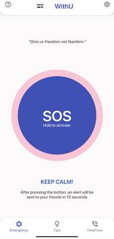

# With You
## Description
WithYou SOS App for Safety is a mobile application developed using Android Studio and Java. The app aims to provide users with a reliable safety solution during emergencies. With a simple and intuitive interface, users can quickly send distress signals to their pre-selected emergency contacts, sharing real-time location updates and essential information to ensure their safety.

Whether you are walking alone at night, going on a trip, or facing any potentially unsafe situation, WithYou SOS has got your back. Our mission is to help users feel safe and confident, knowing that they can quickly seek assistance whenever needed.

### Key Features
1. SOS Button
2. Real-time Location Sharing
3. Custom Emergency Contacts
4. In-App Messaging
5. Customizable Settings
6. Offline Support
7. User Authentication
8. Data Privacy

#### Requirements
<ul>
<li>Android Studio</li>
<li>Android device with USB debugging enabled</li>

